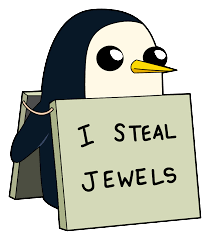

# PENG-WIN



This is my first simple web game with HTML and jQuery, can be played in desktop only, about a penguin who steals jewels, in here you can see the wireframe for the game screens 


### Game Story: 
Our Penguin went to the Ice King castle to steal his jewles, but the castle is angry and started to throw snowballs at him to kick him out.
Let the **PENG-WIN** this game by catching the falling jewles as many as you can and avoiding the snowballs. The more jewels you catch the more scores you get.
**Use left and right arrows to move**

### Gameplay Overview:

Watch out over the snowballs you only got three lives!


Get more jewel to raise your score

### Sample Demo:
[PING-WIN](https://pages.git.generalassemb.ly/raneen/First-Poject_Peng-Win/)

### Built With:
- HTML
- CSS
- JavaScript
- jQuery

#### JavaScript/JQuery:

##### Falling Items:
```javascript
        item.data('value', Math.round(Math.random()));

        if (item.data('value')) {
            var jewels = ['./images/blue.png', './images/red.png', './images/purple.png', './images/pink.png']
            var index = random(0, jewels.length - 1)
            var jewelColor = 'url(' + jewels[index] + ')'

            item.css({ 'background': jewelColor, 'background-size': 'contain', 'background-repeat': 'no-repeat' });
        } else {
            item.css({ 'background': 'url(./images/snowball.png)', 'background-size': 'contain', 'background-repeat': 'no-repeat' });
        }
```
This code shows how the item is resopning randomly based on the value it get (0 for snowballs and 1 for jewels), also it's randomly choose the color for the jewel from an array of jewels.

##### Controls:
```javascript
    $penguin = $("#moveCharacter");
    $(document).keydown(function (e) {
        var pengPosition = $penguin.position();

        switch (e.which) {
            case 37://left
                if (pengPosition.left > 16)
                    $penguin.css('left', pengPosition.left - 20 + 'px')
                break;
            case 39://right
                if (pengPosition.left < 610)
                    $penguin.css('left', pengPosition.left + 20 + 'px')
                break;

        }
    });
```
Added if statement to check when user press left or right arrow, to check there position and don't let user move if he reached end of game canvas.

##### Game Over and Score:
```javascript
    timer = setInterval(() => {
        if (time < 10) {

            $(".timer").text('0' + time--);
        }
        else {
            $(".timer").text(time--);
        }

        if (time < 0 || !gameStatus||home) {
            clearInterval(timer);
            gameStatus = false;
            ending.play();
            $('#hide').css('visibility', 'visible');
        }
    }, 1000);
```
Game is over once time is up ```$('#hide')``` is referring to a 'Game Over' text that is hidden at start

```javascript
        var check = setInterval(() => {
            if (home) clearInterval(check)//if the user wanted to go back home stop this interval immediately
            if (checkCollision($penguin, item)) {
                if (item.data('value')) {//value =1 that means it's a jewel
                    item.remove()//remove jewels when penguin touch it and increase score 
                    jewel.play()
                    score += 10;
                    $('.score').text(score)
                    if (score == 40) {
                        $('#stars').append(``)
                    }
                    if (score == 90) {
                        $('#stars').append(``)
                    }
                    if (score == 120) {
                        $('#stars').append(``)
                    }
                }
                else {
                    item.remove();//remove snowball when penguin touch it and lose one heart
                    snowball.play()
                    $('.lives').last().remove();
                    if (!$('.lives').length) {
                        gameStatus = false;
                        ending.play();
                        $('#hide').css('visibility', 'visible');
                    }
                }

            }
        }, 20); //it check for collision every 20ms
```
Also game is over once there's no lives left with user (lose a heart when character touch a snowball), and this is done with checking for collision every 20 ms with any falling item in the screen, if it's a jewel then increas the score, otherwise take out one heart.

### Future Plans:
- Add moving obstacles.
- User choose level of difficulty.

### Credits:
- I used [checking collision](https://gist.github.com/jaxxreal/7527349) code by [@jaxxreal](https://gist.github.com/jaxxreal)
- also used this code by [@Jess](https://codepen.io/NotJess) to get the [falling items](https://codepen.io/NotJess/pen/VmvvRO) adjusted and added what's needed for my game.
- [Background image.](https://www.ghostshrimpglobal.com/ice-kingdom)

